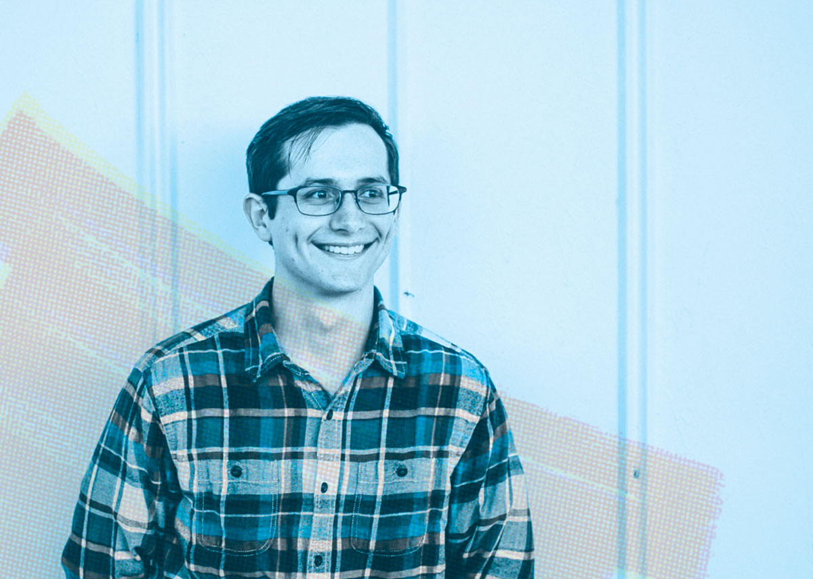

# How’s it going? I’m Ethan.
I am a designer and marketer from the beautiful rolling hills of Western Kentucky. 

My key focuses are on branding, video creation, and digital strategy. I’ve spent the last four years helping people solidify their online presence for work and fun. 

Outside of work, I’m interested in personal finance, cooking, and self-improvement.

## Marketing

I’m currently a marketer for one of the top dealerships in the mid-south region. We’re combining award-winning customer service with a digital first strategy to provide the same small-town experience to over 30 states.

## A Brief History
**1994** - Born in Owensboro, Kentucky.

**2000** - Survived Y2K, created a few comics about a minotaur.

**2008-2011** - Began an interest in film and animation through Pivot Animator and EasyToon.

**2012** - Received scholarship to pursue Graphic Design at Murray State University.

**2014-2016** - Worked as an RA and developed a passion for community service.

**2016** - Finished BFA in Graphic Design at Murray State University.

**2017** - Got Married, moved back to my hometown, watched a solar eclipse.